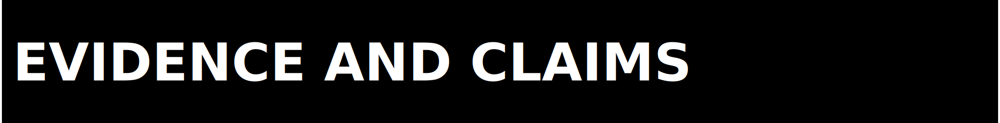

  

  

ZPE-Mocap governance exists to keep claims, evidence, and public posture
aligned. The source repo is the authority surface. Historical artifacts are
retained as lineage and do not override current repo-facing truth.

  

Claim rules:

- Promoted metrics must point to in-repo artifacts.
- Synthetic-corpus evidence may not be framed as real-corpus proof.
- CMU-backed commercialization-safe closure is not promoted until the CMU gate
  is run and artifacts exist in-repo.
- Blender runtime proof and clean-clone verification must be explicit and
  artifact-backed before they can be promoted.

  

This governance file applies to:

- documentation and claim language
- proof and audit surfaces
- release gating and status language
- public support and intake flow

  

Out of scope here:

- legal license terms (see `LICENSE`)
- runtime implementation details (see `docs/ARCHITECTURE.md`)
- contribution workflow specifics (see `CONTRIBUTING.md`)

  

Evidence disputes should be filed as issues with a direct artifact path and
counter-evidence. Claims without evidence remain `UNKNOWN` or are removed.

  

