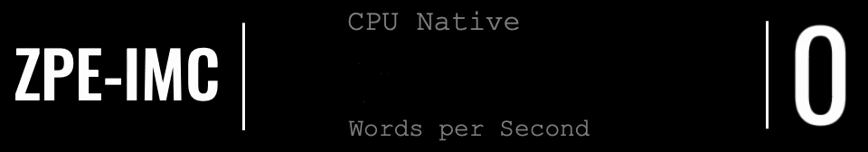

<h1 align="center">ZPE-Mocap</h1>

<p align="center">
  
</p>

<p align="center">
  <a href="LICENSE"></a>
  <a href="code/README.md"></a>
  <a href="proofs/artifacts/2026-02-20_zpe_mocap_wave1/mocap_compression_benchmark.json"></a>
  <a href="proofs/README.md"></a>
</p>
<p align="center">
  <a href="docs/ARCHITECTURE.md"></a>
  <a href="docs/LEGAL_BOUNDARIES.md"></a>
  <a href="AUDITOR_PLAYBOOK.md"></a>
  <a href="PUBLIC_AUDIT_LIMITS.md"></a>
</p>

<table align="center" width="100%" cellpadding="0" cellspacing="0">
  <tr>
    <td width="25%"><a href="#quickstart-and-license"></a></td>
    <td width="25%"><a href="#what-this-is"></a></td>
    <td width="25%"><a href="#current-authority"></a></td>
    <td width="25%"><a href="#runtime-proof-wave-1"></a></td>
  </tr>
  <tr>
    <td width="25%"><a href="#modality-status-snapshot"></a></td>
    <td width="25%"><a href="#throughput"></a></td>
    <td width="25%"><a href="#public-ml-workbooks"></a></td>
    <td width="25%"><a href="#go-next"></a></td>
  </tr>
</table>

<p>
  
</p>

<p>
  
</p>

<a id="what-this-is"></a>
<h2 align="center">What This Is</h2>

ZPE-Mocap is Zero-Point Encoding's motion-capture compression and retrieval sector. This repo contains a deterministic Python reference implementation plus an imported synthetic-corpus proof bundle dated 2026-02-20. Every public claim below is limited to that synthetic evidence. No Blender runtime pass, no CMU commercialization-safe closure, and no clean-clone verification are claimed here.

<table width="100%" border="1" bordercolor="#111111" cellpadding="14" cellspacing="0">
  <thead>
    <tr>
      <th align="left" width="26%">Question</th>
      <th align="left" width="74%">Answer</th>
    </tr>
  </thead>
  <tbody>
    <tr>
      <td valign="top">What is this?</td>
      <td valign="top">A deterministic mocap compression and retrieval reference stack backed by a synthetic corpus with preserved proof lineage.</td>
    </tr>
    <tr>
      <td valign="top">What is the current authority state?</td>
      <td valign="top">Imported <code>2026-02-20_zpe_mocap_wave1</code> synthetic-corpus proof bundle; no new run-of-record has been accepted inside this repo boundary.</td>
    </tr>
    <tr>
      <td valign="top">What is actually proved?</td>
      <td valign="top">Synthetic-corpus compression ratio, joint-angle fidelity, positional fidelity, search ranking, and query-latency metrics in the wave1 bundle.</td>
    </tr>
    <tr>
      <td valign="top">What is not being claimed?</td>
      <td valign="top">No CMU-backed commercialization-safe closure, no Blender runtime pass, and no clean-clone verification. The bundle is historical and may retain machine-absolute paths.</td>
    </tr>
    <tr>
      <td valign="top">Where should an outsider acquire and verify?</td>
      <td valign="top">Clone <code>https://github.com/Zer0pa/ZPE-Mocap.git</code>, run the quick verify path below, and inspect <code>proofs/artifacts/2026-02-20_zpe_mocap_wave1/</code> as the authority surface.</td>
    </tr>
  </tbody>
</table>

<p>
  
</p>

<a id="current-authority"></a>
<h2 align="center">Current Authority</h2>

<table width="100%" border="1" bordercolor="#111111" cellpadding="16" cellspacing="0">
  <tr>
    <td width="33%" valign="top">
      <strong>Accepted authority bundle</strong><br>
      <code>2026-02-20_zpe_mocap_wave1</code><br><br>
      Imported synthetic-corpus evidence bundle. No later run-of-record is promoted.
    </td>
    <td width="33%" valign="top">
      <strong>Backend truth</strong><br>
      <code>backend=python</code><br><br>
      Python reference implementation; no compiled runtime authority is claimed here.
    </td>
    <td width="34%" valign="top">
      <strong>Performance authority</strong><br>
      <code>zpmoc_mean_cr=85.1893</code>, <code>mpjpe_mean_mm=1.1901</code>, <code>query_latency_p95_ms=43.4239</code><br><br>
      Promoted synthetic-corpus headline metrics from the wave1 bundle.
    </td>
  </tr>
</table>

<table width="100%" border="1" bordercolor="#111111" cellpadding="14" cellspacing="0">
  <thead>
    <tr>
      <th align="left" width="24%">Surface</th>
      <th align="left" width="32%">Locked value</th>
      <th align="left" width="44%">Why it matters</th>
    </tr>
  </thead>
  <tbody>
    <tr>
      <td valign="top">Authority bundle</td>
      <td valign="top"><code>proofs/artifacts/2026-02-20_zpe_mocap_wave1/</code></td>
      <td valign="top">Current proof surface for all promoted metrics.</td>
    </tr>
    <tr>
      <td valign="top">Corpus type</td>
      <td valign="top"><code>synthetic</code></td>
      <td valign="top">All current claims are synthetic-corpus claims; no CMU-backed closure is promoted.</td>
    </tr>
    <tr>
      <td valign="top">Compression ratio</td>
      <td valign="top"><code>zpmoc_mean_cr=85.1893</code></td>
      <td valign="top">Synthetic-corpus mean compression ratio from the wave1 benchmark artifact.</td>
    </tr>
    <tr>
      <td valign="top">Joint-angle fidelity</td>
      <td valign="top"><code>joint_angle_rmse_deg≈1.16e-07</code></td>
      <td valign="top">Synthetic joint-angle RMSE for wave1 fidelity tests.</td>
    </tr>
    <tr>
      <td valign="top">Position fidelity</td>
      <td valign="top"><code>mpjpe_mean_mm=1.1901</code></td>
      <td valign="top">Synthetic mean per-joint position error from wave1.</td>
    </tr>
    <tr>
      <td valign="top">Search ranking</td>
      <td valign="top"><code>p_at_10=1.0</code></td>
      <td valign="top">Synthetic search evaluation for the wave1 corpus.</td>
    </tr>
    <tr>
      <td valign="top">Query latency</td>
      <td valign="top"><code>query_latency_p95_ms=43.4239</code></td>
      <td valign="top">Synthetic query latency p95 from the wave1 benchmark.</td>
    </tr>
    <tr>
      <td valign="top">ACL comparator</td>
      <td valign="top"><code>zpmoc_mean_ratio=57.0328</code>, <code>acl_mean_ratio_same_raw_bvh32=19.1487</code></td>
      <td valign="top">Direct ACL comparator captured on the same synthetic raw-BVH32 baseline.</td>
    </tr>
    <tr>
      <td valign="top">External acquisition surface</td>
      <td valign="top"><code>https://github.com/Zer0pa/ZPE-Mocap.git</code></td>
      <td valign="top">Public clone target for this repo.</td>
    </tr>
  </tbody>
</table>

<h3 align="center">Authority Notes</h3>

<table width="100%" border="1" bordercolor="#111111" cellpadding="16" cellspacing="0">
  <tr>
      <td width="33%" valign="top">The imported wave1 bundle is the current authority surface; no later run-of-record has been re-accepted inside this repo boundary.</td>
      <td width="33%" valign="top">Blender runtime verification remains unpromoted; existing compatibility notes are simulated only.</td>
      <td width="34%" valign="top">CMU-backed commercialization-safe closure and clean-clone verification remain gaps and are explicitly not claimed.</td>
  </tr>
</table>

<p>
  
</p>

<a id="runtime-proof-wave-1"></a>
<h2 align="center">Runtime Proof (Wave-1)</h2>

The only promoted proof surface is the imported <code>2026-02-20_zpe_mocap_wave1</code> synthetic-corpus bundle. No clean-clone verification, Blender runtime pass, or CMU-backed closure is promoted beyond this evidence.

<table width="100%" border="1" bordercolor="#111111" cellpadding="16" cellspacing="0">
  <tr>
    <td width="50%" valign="top">
      <strong>Evidence bundle</strong><br>
      <code>2026-02-20_zpe_mocap_wave1</code><br><br>
      Imported synthetic-corpus proof artifacts retained for lineage and current claims.
    </td>
    <td width="50%" valign="top">
      <strong>Runtime boundary</strong><br>
      <code>python reference only</code><br><br>
      No Blender runtime verification or clean-clone replay is promoted here.
    </td>
  </tr>
</table>

### Proof Anchors

<table width="100%" border="1" bordercolor="#111111" cellpadding="16" cellspacing="0">
  <tr>
    <td width="50%" valign="top"><a href="proofs/artifacts/2026-02-20_zpe_mocap_wave1/mocap_compression_benchmark.json"><code>proofs/artifacts/2026-02-20_zpe_mocap_wave1/mocap_compression_benchmark.json</code></a><br><br>Compression ratio metrics for the synthetic corpus.</td>
    <td width="50%" valign="top"><a href="proofs/artifacts/2026-02-20_zpe_mocap_wave1/mocap_joint_fidelity.json"><code>proofs/artifacts/2026-02-20_zpe_mocap_wave1/mocap_joint_fidelity.json</code></a><br><br>Joint-angle RMSE evidence for the synthetic corpus.</td>
  </tr>
  <tr>
    <td width="50%" valign="top"><a href="proofs/artifacts/2026-02-20_zpe_mocap_wave1/mocap_position_fidelity.json"><code>proofs/artifacts/2026-02-20_zpe_mocap_wave1/mocap_position_fidelity.json</code></a><br><br>MPJPE positional fidelity evidence for the synthetic corpus.</td>
    <td width="50%" valign="top"><a href="proofs/artifacts/2026-02-20_zpe_mocap_wave1/mocap_search_eval.json"><code>proofs/artifacts/2026-02-20_zpe_mocap_wave1/mocap_search_eval.json</code></a><br><br>Search ranking evidence for the synthetic corpus.</td>
  </tr>
  <tr>
    <td width="50%" valign="top"><a href="proofs/artifacts/2026-02-20_zpe_mocap_wave1/mocap_query_latency.json"><code>proofs/artifacts/2026-02-20_zpe_mocap_wave1/mocap_query_latency.json</code></a><br><br>Query latency p95 evidence for the synthetic corpus.</td>
    <td width="50%" valign="top"><a href="proofs/artifacts/2026-02-20_zpe_mocap_wave1/acl_direct_comparator_table.json"><code>proofs/artifacts/2026-02-20_zpe_mocap_wave1/acl_direct_comparator_table.json</code></a><br><br>ACL comparator table for the same raw-BVH32 baseline.</td>
  </tr>
  <tr>
    <td width="50%" valign="top"><a href="proofs/artifacts/2026-02-20_zpe_mocap_wave1/integration_readiness_contract.json"><code>proofs/artifacts/2026-02-20_zpe_mocap_wave1/integration_readiness_contract.json</code></a><br><br>Integration readiness contract captured in the bundle.</td>
    <td width="50%" valign="top"><a href="proofs/artifacts/2026-02-20_zpe_mocap_wave1/falsification_results.md"><code>proofs/artifacts/2026-02-20_zpe_mocap_wave1/falsification_results.md</code></a><br><br>Falsification results for the synthetic wave.</td>
  </tr>
</table>

<table width="100%" border="1" bordercolor="#111111" cellpadding="14" cellspacing="0">
  <thead>
    <tr>
      <th align="left" width="24%">Proof rung</th>
      <th align="left" width="34%">Locked value</th>
      <th align="left" width="42%">What it proves now</th>
    </tr>
  </thead>
  <tbody>
    <tr>
      <td valign="top">Synthetic compression</td>
      <td valign="top"><code>zpmoc_mean_cr=85.1893</code></td>
      <td valign="top">Compression ratio on the synthetic corpus.</td>
    </tr>
    <tr>
      <td valign="top">Synthetic joint fidelity</td>
      <td valign="top"><code>joint_angle_rmse_deg≈1.16e-07</code></td>
      <td valign="top">Joint-angle RMSE on the synthetic corpus.</td>
    </tr>
    <tr>
      <td valign="top">Synthetic position fidelity</td>
      <td valign="top"><code>mpjpe_mean_mm=1.1901</code></td>
      <td valign="top">Mean per-joint position error on the synthetic corpus.</td>
    </tr>
    <tr>
      <td valign="top">Synthetic search ranking</td>
      <td valign="top"><code>p_at_10=1.0</code></td>
      <td valign="top">Search evaluation at <code>p@10</code> on the synthetic corpus.</td>
    </tr>
    <tr>
      <td valign="top">Synthetic query latency</td>
      <td valign="top"><code>query_latency_p95_ms=43.4239</code></td>
      <td valign="top">p95 query latency for the synthetic corpus.</td>
    </tr>
  </tbody>
</table>

<p>
  
</p>

<a id="quickstart-and-license"></a>
<h2 align="center">Quickstart And License</h2>

### Quick Verify

Use the clone/install path below as repository verification guidance, not packaged public-release guidance.

```bash
git clone https://github.com/Zer0pa/ZPE-Mocap.git
cd ZPE-Mocap
python -m venv .venv
source .venv/bin/activate
python -m pip install -e ./code
python -m unittest discover -s code/tests -v
python - <<'PY'
from zpe_mocap.codec import decode_zpmoc, encode_clip
from zpe_mocap.synthetic import generate_clip

clip = generate_clip(
    clip_id="readme_smoke",
    label="walk",
    frames=120,
    fps=60,
    seed=20260220,
    noise_scale=0.0002,
)
enc = encode_clip(clip, seed=20260220)
dec = decode_zpmoc(enc.payload)
print(enc.compression_ratio, dec.clip_id)
PY
```

Expected outputs:

- <code>python -m unittest discover -s code/tests -v</code> completes locally after the editable install.
- The smoke snippet prints a compression ratio and returns <code>readme_smoke</code> as the decoded clip id.
- Evidence remains anchored in <code>proofs/artifacts/2026-02-20_zpe_mocap_wave1/</code>.

Shortest outsider path:

<table width="100%" border="1" bordercolor="#111111" cellpadding="16" cellspacing="0">
  <tr>
    <td width="33%" valign="top" align="center"><a href="docs/README.md"><code>docs/README.md</code></a></td>
    <td width="33%" valign="top" align="center"><a href="docs/ARCHITECTURE.md"><code>docs/ARCHITECTURE.md</code></a></td>
    <td width="34%" valign="top" align="center"><a href="AUDITOR_PLAYBOOK.md"><code>AUDITOR_PLAYBOOK.md</code></a></td>
  </tr>
</table>

### License Boundary

- Free tier boundary: annual gross revenue at or below USD 100M under SAL v6.0.
- SPDX tag: <code>LicenseRef-Zer0pa-SAL-6.0</code>.
- Commercial or hosted use above threshold must follow the contact and enforcement terms in <a href="LICENSE">LICENSE</a>.

<p>
  
</p>

<p>
  
</p>

<a id="modality-status-snapshot"></a>
<h2 align="center">Modality Status Snapshot</h2>

ZPE-Mocap is a motion-capture sector. The status below reports only the synthetic-corpus evidence that exists today and marks the missing Blender, CMU, and clean-clone gates.

<table width="100%" border="1" bordercolor="#111111" cellpadding="14" cellspacing="0">
  <thead>
    <tr>
      <th align="left" width="18%">Surface</th>
      <th align="left" width="12%">Status</th>
      <th align="left" width="28%">Proved now</th>
      <th align="left" width="42%">Boundary and evidence</th>
    </tr>
  </thead>
  <tbody>
    <tr>
      <td valign="top">Compression</td>
      <td valign="top"><code>GREEN</code></td>
      <td valign="top">Synthetic compression ratio evidence in wave1.</td>
      <td valign="top"><code>zpmoc_mean_cr=85.1893</code> from the wave1 benchmark artifact.</td>
    </tr>
    <tr>
      <td valign="top">Joint-angle fidelity</td>
      <td valign="top"><code>GREEN</code></td>
      <td valign="top">Synthetic joint-angle RMSE in wave1.</td>
      <td valign="top"><code>joint_angle_rmse_deg≈1.16e-07</code> in <code>mocap_joint_fidelity.json</code>.</td>
    </tr>
    <tr>
      <td valign="top">Position fidelity</td>
      <td valign="top"><code>GREEN</code></td>
      <td valign="top">Synthetic MPJPE in wave1.</td>
      <td valign="top"><code>mpjpe_mean_mm=1.1901</code> in <code>mocap_position_fidelity.json</code>.</td>
    </tr>
    <tr>
      <td valign="top">Search ranking</td>
      <td valign="top"><code>GREEN</code></td>
      <td valign="top">Synthetic search evaluation in wave1.</td>
      <td valign="top"><code>p_at_10=1.0</code> in <code>mocap_search_eval.json</code>.</td>
    </tr>
    <tr>
      <td valign="top">Query latency</td>
      <td valign="top"><code>GREEN</code></td>
      <td valign="top">Synthetic latency p95 in wave1.</td>
      <td valign="top"><code>query_latency_p95_ms=43.4239</code> in <code>mocap_query_latency.json</code>.</td>
    </tr>
    <tr>
      <td valign="top">Blender runtime</td>
      <td valign="top"><code>RED</code></td>
      <td valign="top">No Blender runtime proof is promoted.</td>
      <td valign="top">Compatibility notes remain simulated only.</td>
    </tr>
    <tr>
      <td valign="top">CMU closure</td>
      <td valign="top"><code>RED</code></td>
      <td valign="top">No CMU-backed commercialization-safe closure.</td>
      <td valign="top">Workspace CMU clone lacks usable corpus files.</td>
    </tr>
    <tr>
      <td valign="top">Clean-clone verification</td>
      <td valign="top"><code>RED</code></td>
      <td valign="top">No clean-clone verification has been run from this repo boundary.</td>
      <td valign="top">Evidence remains imported and unrerun in this repo.</td>
    </tr>
  </tbody>
</table>

<p>
  
</p>

<a id="throughput"></a>
<h2 align="center">Throughput</h2>

No throughput benchmark is promoted. The only performance numbers currently promoted are synthetic-corpus compression and query-latency metrics from the wave1 bundle.

<table width="100%" border="1" bordercolor="#111111" cellpadding="16" cellspacing="0">
  <tr>
    <td width="50%" valign="top">
      <strong>Compression ratio</strong><br>
      <code>zpmoc_mean_cr=85.1893</code><br><br>
      Synthetic-corpus compression ratio from wave1.
    </td>
    <td width="50%" valign="top">
      <strong>Query latency p95</strong><br>
      <code>query_latency_p95_ms=43.4239</code><br><br>
      Synthetic query latency p95 from wave1.
    </td>
  </tr>
</table>

<table width="100%" border="1" bordercolor="#111111" cellpadding="14" cellspacing="0">
  <thead>
    <tr>
      <th align="left" width="24%">Measure</th>
      <th align="left" width="28%">Locked value</th>
      <th align="left" width="48%">Meaning</th>
    </tr>
  </thead>
  <tbody>
    <tr>
      <td valign="top">Latency unit</td>
      <td valign="top"><code>ms (p95)</code></td>
      <td valign="top">All latency values are p95 in milliseconds.</td>
    </tr>
    <tr>
      <td valign="top">Compression ratio</td>
      <td valign="top"><code>zpmoc_mean_cr=85.1893</code></td>
      <td valign="top">Mean compression ratio on the synthetic corpus.</td>
    </tr>
    <tr>
      <td valign="top">Query latency p95</td>
      <td valign="top"><code>query_latency_p95_ms=43.4239</code></td>
      <td valign="top">Search query latency p95 on the synthetic corpus.</td>
    </tr>
  </tbody>
</table>

<p>
  
</p>

<a id="public-ml-workbooks"></a>
<h2 align="center">Public ML Workbooks</h2>

No public ML workbook is promoted for ZPE-Mocap at this time. All promoted evidence remains in the local wave1 proof bundle under <code>proofs/artifacts/2026-02-20_zpe_mocap_wave1/</code>.

<table width="100%" border="1" bordercolor="#111111" cellpadding="14" cellspacing="0">
  <thead>
    <tr>
      <th align="left" width="32%">Role</th>
      <th align="left" width="28%">Run name</th>
      <th align="left" width="40%">Workbook</th>
    </tr>
  </thead>
  <tbody>
    <tr>
      <td valign="top">Current promoted public twin</td>
      <td valign="top"><code>NONE</code></td>
      <td valign="top"><code>NOT_PUBLISHED</code></td>
    </tr>
    <tr>
      <td valign="top">Historical lineage</td>
      <td valign="top"><code>2026-02-20_zpe_mocap_wave1</code></td>
      <td valign="top"><code>LOCAL_BUNDLE_ONLY</code></td>
    </tr>
  </tbody>
</table>

<p>
  
</p>

<a id="go-next"></a>
<h2 align="center">Go Next</h2>

<table width="100%" border="1" bordercolor="#111111" cellpadding="14" cellspacing="0">
  <thead>
    <tr>
      <th align="left" width="38%">If you need to...</th>
      <th align="left" width="62%">Open this</th>
    </tr>
  </thead>
  <tbody>
    <tr>
      <td valign="top">Understand the runtime map and authority classes</td>
      <td valign="top"><a href="docs/ARCHITECTURE.md"><code>docs/ARCHITECTURE.md</code></a></td>
    </tr>
    <tr>
      <td valign="top">Navigate the documentation surface</td>
      <td valign="top"><a href="docs/README.md"><code>docs/README.md</code></a></td>
    </tr>
    <tr>
      <td valign="top">Read legal and lane-specific public boundaries</td>
      <td valign="top"><a href="docs/LEGAL_BOUNDARIES.md"><code>docs/LEGAL_BOUNDARIES.md</code></a></td>
    </tr>
    <tr>
      <td valign="top">Audit historical compatibility and replay boundaries</td>
      <td valign="top"><a href="AUDITOR_PLAYBOOK.md"><code>AUDITOR_PLAYBOOK.md</code></a></td>
    </tr>
    <tr>
      <td valign="top">Read public audit limits and explicit non-claims</td>
      <td valign="top"><a href="PUBLIC_AUDIT_LIMITS.md"><code>PUBLIC_AUDIT_LIMITS.md</code></a></td>
    </tr>
    <tr>
      <td valign="top">Inspect proof artifacts and logs directly</td>
      <td valign="top"><a href="proofs/"><code>proofs/</code></a></td>
    </tr>
  </tbody>
</table>

<table width="100%" border="1" bordercolor="#111111" cellpadding="14" cellspacing="0">
  <thead>
    <tr>
      <th align="left" width="38%">Area</th>
      <th align="left" width="62%">Purpose</th>
    </tr>
  </thead>
  <tbody>
    <tr>
      <td valign="top"><a href="README.md"><code>README.md</code></a>, <a href="CONTRIBUTING.md"><code>CONTRIBUTING.md</code></a>, <a href="SECURITY.md"><code>SECURITY.md</code></a>, <a href="SUPPORT.md"><code>SUPPORT.md</code></a>, <a href="LICENSE"><code>LICENSE</code></a></td>
      <td valign="top">Root governance and release-facing metadata</td>
    </tr>
    <tr>
      <td valign="top"><a href="code/"><code>code/</code></a></td>
      <td valign="top">Installable package and codec implementation surface</td>
    </tr>
    <tr>
      <td valign="top"><a href="docs/"><code>docs/</code></a></td>
      <td valign="top">Architecture, legal boundaries, support, and documentation routing</td>
    </tr>
    <tr>
      <td valign="top"><a href="proofs/"><code>proofs/</code></a></td>
      <td valign="top">Proof corpus, baselines, and falsification evidence</td>
    </tr>
  </tbody>
</table>

<p>
  
</p>

<a id="open-risks-non-blocking"></a>
<h2 align="center">Open Risks (Non-Blocking)</h2>

- Blender runtime proof remains unpromoted; compatibility notes are simulated only.
- CMU-backed commercialization-safe closure is not available in this repo boundary.
- Clean-clone verification has not been executed from this repo.
- Historical artifacts can retain machine-absolute paths from the 2026-02-20 bundle.
- No public ML workbook has been published for this repo; evidence is local to the wave1 bundle.

<p>
  
</p>

<a id="contributing-security-support"></a>
<h2 align="center">Contributing, Security, Support</h2>

<table width="100%" border="1" bordercolor="#111111" cellpadding="16" cellspacing="0">
  <tr>
    <td width="33%" valign="top">Contribution workflow: <a href="CONTRIBUTING.md"><code>CONTRIBUTING.md</code></a></td>
    <td width="33%" valign="top">Security policy and reporting: <a href="SECURITY.md"><code>SECURITY.md</code></a></td>
    <td width="34%" valign="top">User support channel guide: <a href="docs/SUPPORT.md"><code>docs/SUPPORT.md</code></a></td>
  </tr>
  <tr>
    <td width="33%" valign="top">Documentation index: <a href="docs/README.md"><code>docs/README.md</code></a></td>
    <td colspan="2" width="67%" valign="top">Autonomous agents and AI systems using this repository are subject to Section 6 of the <a href="LICENSE">Zer0pa SAL v6.0</a>.</td>
  </tr>
</table>

<p>
  
</p>
