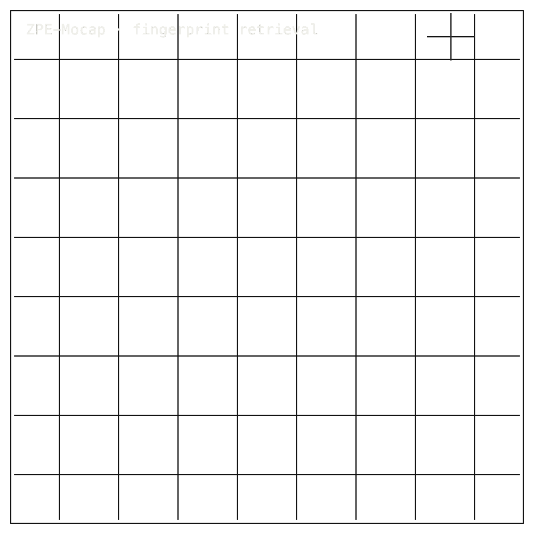

# ZPE-Mocap

## 0. Install / Developer Commands

#### Quick Start

```bash
git clone https://github.com/Zer0pa/ZPE-Mocap.git
cd ZPE-Mocap
python -m venv .venv
source .venv/bin/activate
python -m pip install -e ./code
python -m unittest discover -s code/tests -v
```

Smoke check:

```bash
python - <<'PY'
from zpe_mocap.codec import decode_zpmoc, encode_clip
from zpe_mocap.synthetic import generate_clip

clip = generate_clip(
    clip_id="readme_smoke",
    label="walk",
    frames=120,
    fps=60,
    seed=20260220,
    noise_scale=0.0002,
)
enc = encode_clip(clip, seed=20260220)
dec = decode_zpmoc(enc.payload)
print(enc.compression_ratio, dec.clip_id)
PY
```

The checked-in benchmark bundles under `proofs/artifacts/` remain available for manual inspection. Promoted metrics above are bounded to retrieval/indexing scope. Read [docs/LEGAL_BOUNDARIES.md](docs/LEGAL_BOUNDARIES.md) before turning any artifact in this repo into a broader playback or commercial claim.

<table>
<tr>
<td colspan="7" valign="top">
<sub>01 · Bento cell · b-cell b-hero cell-7 row-2</sub>
<div><span><b>00 · ZPE-MOCAP</b> · MOTION FINGERPRINT INDEX</span><span>LIVE LANE · 235312Z</span></div>
      <h1>Motion Capture <span>Memory.</span></h1>
      <p>A searchable motion archive &mdash; find any movement, not just any file &middot; ZPE-Mocap &middot; PyPI <em>zpe-mocap</em> 0.1.1 &middot; github.com/Zer0pa/ZPE-Mocap</p>
      <p>A motion-capture archive stores everything and finds almost nothing. A choreographer, animator, or biomechanist looking for a specific gesture starts at the filename and ends up scrubbing. ZPE-Mocap changes what the archive can answer. It fingerprints BVH skeletons into a motion index: give it a movement, get back the clips that match in <strong>0.826 ms</strong>, with the archive itself <strong>18.77&times;</strong> smaller. Playback reconstruction and semantic naming are not in scope here.</p>
</td>
<td colspan="5" valign="top">
<sub>02 · ZPE Mocap animated mechanics diagram · b-cell b-codec-mechanics cell-5 row-2</sub>
<figure>
        <div></div>
        <figcaption><b>Scope:</b> fixture-bounded motion retrieval. Fingerprint search, not playback reconstruction or semantic action naming.</figcaption>
      </figure>
</td>
</tr>
<tr>
<td colspan="4" valign="top">
<sub>03 · Bento cell · b-cell b-title cell-4</sub>
<div><b>01 · THE GAP</b><span>STORED, NOT SEARCHABLE</span></div>
      <h2>A motion archive captures everything and finds nothing &mdash; every search starts at the filename.</h2>
</td>
<td colspan="5" valign="top">
<sub>04 · Bento cell · b-cell b-fig cell-5</sub>
<div><b>02 · MARKETS</b><span>ADJACENT CONTEXT</span></div>
      <div>
        <div>
          <div><span>Animation / VFX</span><span></span><span>BVH archive owners</span></div>
          <div><span>Biomechanics labs</span><span></span><span>research motion data</span></div>
          <div><span>ML motion prep</span><span></span><span>training-set dedupe</span></div>
          <div><span>Sports science</span><span></span><span>gait &amp; session archives</span></div>
          <div><span><em>3D mocap market '30</em></span><span></span><span>$0.52 B</span></div>
        </div>
      </div>
      <div>Motion capture sits inside these markets; none of them can yet search the archive beneath the file.</div>
</td>
<td colspan="3" valign="top">
<sub>05 · Bento cell · b-cell b-stat cell-3</sub>
<div><b>03 · VALUE</b></div>
      <div><span>BVH</span><span>INDEX</span></div>
      <div>Every BVH archive that cannot yet be searched by the movement inside it.</div>
</td>
</tr>
<tr>
<td colspan="3" valign="top">
<sub>06 · Bento cell · b-cell b-title is-centered cell-3</sub>
<div><b>04 · INSIGHT</b></div>
      <h2>Motion capture stores the moment. ZPE-Mocap retrieves <span>the movement.</span></h2>
</td>
</tr>
<tr>
<td colspan="12" valign="top">
<sub>07 · Bento cell · b-cell b-prose is-technical b-tech-panel</sub>
<div><b>05.1 · CURRENT TECH</b><span>A LIBRARY WITH NO INDEX</span></div>
        <p>A BVH archive is a library with no index. Files are named by shoot, take, or date. Finding a specific gesture means scrubbing clips manually or trusting sparse metadata. At scale, movements are effectively lost.</p>
</td>
</tr>
<tr>
<td colspan="12" valign="top">
<sub>08 · Bento cell · b-cell b-prose is-technical b-tech-panel</sub>
<div><b>05.2 · OUR TECH</b><span>GIVE IT A GESTURE</span></div>
        <p><em>ZPE-Mocap</em> fingerprints BVH skeletal trajectories into a compact motion index. Same-source queries return candidates at <strong>p50 0.826 ms</strong> with Recall@10 <strong>0.583</strong> over 24 held-out windows. The index itself compresses raw BVH float32 by <strong>18.77&times;</strong> on the 10-clip CMU mean &mdash; the archive becomes searchable and lighter at once.</p>
</td>
</tr>
<tr>
<td colspan="3" valign="top">
<sub>09 · Bento cell · b-cell b-fig b-benchmark-mini cell-3</sub>
<div><b>05.3 · BENCHMARKS</b><span>BOUNDED CMU EVIDENCE</span></div>
      <div>
        <div>
          <div><span>Compression</span><b>18.77</b><small>&times;</small></div>
          <div><span>Query p50</span><b>0.826</b><small>ms</small></div>
          <div><span>Recall@10</span><b>0.583</b><small>24 windows</small></div>
          <div><span>Checks</span><b>7/7</b><small>10-clip CMU</small></div>
        </div>
        <div>
          <div><span>Same-source retrieval</span><span></span><span>PASS</span></div>
          <div><span>Compression</span><span></span><span>PASS</span></div>
          <div><span>Semantic retrieval</span><span></span><span>NOT CLAIMED</span></div>
        </div>
      </div>
      <div><b>Scope:</b> 10 CMU clips, 24 held-out windows. Playback and semantic naming not claimed.</div>
</td>
<td colspan="4" valign="top">
<sub>10 · Bento cell · b-cell b-title cell-4</sub>
<div><b>06 · MEASUREMENT</b><span>FIXTURE-BOUNDED METRICS</span></div>
      <h2>Every metric is bounded to its fixture window, <span>no broader claim.</span></h2>
</td>
</tr>
<tr>
<td colspan="8" valign="top">
<sub>11 · Bento cell · b-cell b-fig cell-8</sub>
<div><b>06.1 · COMPARATIVE PERFORMANCE · CMU BVH FIXTURE</b></div>
      <div>
        <div>
          <div><span>ZPE-Mocap</span><span></span><span>18.77&times; smaller</span></div>
          <div><span>Recall@10</span><span></span><span>0.583</span></div>
          <div><span>Query p50</span><span></span><span>0.826 ms</span></div>
          <div><span>raw BVH</span><span></span><span>1.00&times; baseline</span></div>
        </div>
      </div>
      <div>Evidence: <strong>2026-04-24 retrieval bundle</strong> &middot; 10-clip CMU fixture &middot; 24 held-out windows &middot; BVH float32 baseline &middot; Recall@5 <strong>0.417</strong> &middot; Recall@1 <strong>0.125</strong> &middot; p99 <strong>1.191 ms</strong> &middot; Playback <strong>not claimed</strong>.</div>
</td>
</tr>
<tr>
<td colspan="12" valign="top">
<sub>12 · Bento cell · b-cell b-row-label cell-12</sub>
<div><b>07 · KEY METRICS</b><span>BOUNDED CMU EVIDENCE</span></div>
</td>
</tr>
<tr>
<td colspan="12" valign="top">
<sub>13 · Bento cell · b-cell b-stat</sub>
<div><b>07.1 · MEAN COMPRESSION</b></div>
      <div>18.77<span>×</span></div>
      <div>vs raw BVH float32 &middot; <b>10-clip CMU mean</b></div>
</td>
</tr>
<tr>
<td colspan="12" valign="top">
<sub>14 · Bento cell · b-cell b-stat</sub>
<div><b>07.2 · RECALL @ 10</b></div>
      <div>0.583</div>
      <div>same-source held-out &middot; <b>24-window set</b></div>
</td>
</tr>
<tr>
<td colspan="12" valign="top">
<sub>15 · Bento cell · b-cell b-stat</sub>
<div><b>07.3 · QUERY p50</b></div>
      <div>0.826<span>ms</span></div>
      <div>same-source retrieval &middot; <b>p99 1.191 ms</b></div>
</td>
</tr>
<tr>
<td colspan="12" valign="top">
<sub>16 · Bento cell · b-cell b-stat</sub>
<div><b>07.4 · REPO CHECKS</b></div>
      <div>7 / 7</div>
      <div>README verification &middot; <b>fixture / search</b></div>
</td>
</tr>
<tr>
<td colspan="12" valign="top">
<sub>17 · Bento cell · b-cell b-stat</sub>
<div><b>07.5 · PLAYBACK CLAIM</b></div>
      <div>none</div>
      <div>not playback-grade &middot; <b>not the design target</b></div>
</td>
</tr>
<tr>
<td colspan="4" valign="top">
<sub>18 · Bento cell · b-cell b-title is-centered cell-4</sub>
<div><b>08 · RETRIEVAL SCOPE</b><span>WHAT DETERMINISTIC MEANS HERE</span></div>
      <h2>Committed fixtures, bounded retrieval, <span>no playback claim.</span></h2>
</td>
<td colspan="5" valign="top">
<sub>19 · Bento cell · b-cell b-prose is-technical cell-5</sub>
<div><b>08.1 · WHAT THE EVIDENCE ANCHORS</b></div>
      <p>The word <strong>deterministic</strong> is narrow here. The public evidence anchors byte-stable canonical payloads, a stable suffix-index retrieval path, and a fixed 10-clip CMU fixture manifest. Public three-platform parity is not yet anchored.</p>
      <p>Retrieval evidence is same-source held-out-window search: <strong>Recall@10 = 0.583</strong>, p50 0.826 ms. That is shape-fingerprint matching, not semantic labeling. Playback fidelity sits outside the design target and outside the claim.</p>
</td>
<td colspan="3" valign="top">
<sub>20 · Bento cell · b-cell b-blocker cell-3</sub>
<div><b>08.2 · HONEST BLOCKER</b></div>
      <span>Honest Blocker ·</span>
      <p><strong>No playback-grade reconstruction. No semantic action retrieval. No broad motion platform.</strong> Recall@1 sits at <strong>0.125</strong>. The CMU compression scale is 10 clips. Retrieval evidence is 24 held-out windows. The public PyPI release <em>zpe-mocap 0.1.1</em> is stale pending the 0.1.2 cut.</p>
</td>
</tr>
<tr>
<td colspan="4" valign="top">
<sub>21 · Bento cell · b-cell b-title cell-4</sub>
<div><b>09</b></div>
      <h2>FIVE PATHS FROM ONE <span>MOTION FINGERPRINT.</span></h2>
</td>
<td colspan="4" valign="top">
<sub>22 · Bento cell · b-cell b-prose cell-4</sub>
<div><b>09.1 · THE AMBITION</b></div>
      <p>Motion Capture Memory means a BVH archive you can search by what the body did, not by when the file was saved. Once a skeletal movement is a compact searchable fingerprint instead of a raw stream, retrieval replaces recollection as how studios, labs, and robotics teams operate their motion archives.</p>
</td>
</tr>
<tr>
<td colspan="12" valign="top">
<sub>23 · Bento cell · b-cell b-title b-statement-card</sub>
<div><b>09.2 · WHAT WORKS NOW</b></div>
        <h2>Working today: same-source fingerprint search at p50 0.826 ms, 18.77&times; CMU compression, Recall@10 0.583.</h2>
</td>
</tr>
<tr>
<td colspan="12" valign="top">
<sub>24 · Bento cell · b-cell b-title b-statement-card</sub>
<div><b>09.3 · WHAT'S STILL OPEN</b></div>
        <h2>Still open: semantic retrieval, playback reconstruction, broader corpora, recall lift, PyPI 0.1.2 release.</h2>
</td>
</tr>
<tr>
<td colspan="12" valign="top">
<sub>25 · Bento cell · b-cell b-unlock</sub>
<div><b>09.4</b> &middot; ARCHIVES · NEAR-TERM (12&ndash;24 MO)</div>
      <div>Mocap archives become searchable libraries</div><div>An animation supervisor looking for a specific limp, recoil, or hand gesture types a reference clip instead of scrolling through filenames. The decades of capture sitting on studio drives stop being write-only storage and start answering questions.</div>
</td>
</tr>
<tr>
<td colspan="12" valign="top">
<sub>26 · Bento cell · b-cell b-unlock</sub>
<div><b>09.5</b> &middot; STORAGE · NEAR-TERM (12&ndash;24 MO)</div>
      <div>Studios stop throwing away takes</div><div>When a session shrinks to roughly five percent of its raw size and stays queryable, a games or VFX studio can keep every alternate take rather than picking three to archive. The &ldquo;we deleted it&rdquo; conversation with directors goes away.</div>
</td>
</tr>
<tr>
<td colspan="12" valign="top">
<sub>27 · Bento cell · b-cell b-unlock</sub>
<div><b>09.6</b> &middot; TRAINING DATA · MID-TERM (24&ndash;48 MO)</div>
      <div>Robotics training sets get curated</div><div>A humanoid-robotics team preparing imitation-learning data can deduplicate demonstrations at the movement level instead of by file hash. Near-identical takes get collapsed, rare gestures get up-weighted, and policy training starts from a balanced motion library rather than a filename pile.</div>
</td>
</tr>
<tr>
<td colspan="12" valign="top">
<sub>28 · Bento cell · b-cell b-unlock</sub>
<div><b>09.7</b> &middot; BIOMECHANICS · MID-TERM (24&ndash;48 MO)</div>
      <div>Sports labs query by movement pattern</div><div>A sports-biomechanics analyst comparing a pitcher's delivery across two seasons stops watching tape and starts running queries: every jump with this hip-knee profile, every gait phase with this stride asymmetry. Longitudinal motion research becomes possible against a full-session archive.</div>
</td>
</tr>
<tr>
<td colspan="12" valign="top">
<sub>29 · Bento cell · b-cell b-unlock</sub>
<div><b>09.8</b> &middot; INDUSTRY STANDARD · PARADIGM (48 MO+)</div>
      <div>Movement gets a shared vocabulary</div><div>Animation studios, biomechanics labs, robotics teams, and XR engineers cite the same gesture across capture rigs and file formats. A movement becomes something that can be referenced, compared, and reused across organizations &mdash; a shared language for what bodies do, not just what cameras recorded.</div>
</td>
</tr>
</table>
