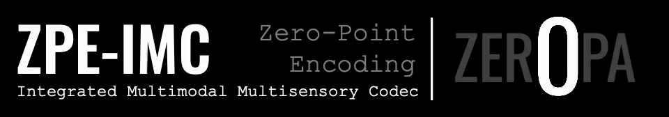

<h1 align="center">ZPE-Mocap</h1>

<p align="center">
  
</p>

<p align="center">
  <a href="LICENSE"></a>
  <a href="code/README.md"></a>
  <a href="proofs/artifacts/2026-02-20_zpe_mocap_wave1/mocap_compression_benchmark.json"></a>
  <a href="proofs/README.md"></a>
</p>
<p align="center">
  <a href="docs/ARCHITECTURE.md"></a>
  <a href="docs/LEGAL_BOUNDARIES.md"></a>
  <a href="AUDITOR_PLAYBOOK.md"></a>
  <a href="PUBLIC_AUDIT_LIMITS.md"></a>
</p>

<table align="center" width="100%" cellpadding="0" cellspacing="0">
  <tr>
    <td width="25%"><a href="#quickstart-and-license"></a></td>
    <td width="25%"><a href="#what-this-is"></a></td>
    <td width="25%"><a href="#current-authority"></a></td>
    <td width="25%"><a href="#runtime-proof-wave-1"></a></td>
  </tr>
  <tr>
    <td width="25%"><a href="#modality-status-snapshot"></a></td>
    <td width="25%"><a href="#throughput"></a></td>
    <td width="25%"><a href="#public-ml-workbooks"></a></td>
    <td width="25%"><a href="#go-next"></a></td>
  </tr>
</table>

---

<a id="commercial-front-door"></a>

## What This Is

ZPE-Mocap applies the ZPE deterministic 8-primitive encoding architecture to motion-capture data — compression, search, and retrieval for spatial-temporal skeletal signals.

**Real-data results (CMU fixture, 10 BVH clips):** 18.77× compression, 32.45 mm MPJPE, 82.51° angle RMSE. Evidence: `proofs/artifacts/2026-04-14_cmu_corpus_benchmark/`.

**Synthetic-corpus results (identity encoding):** 85.19× compression, 1.19 mm MPJPE, 1.16e-07° angle RMSE, p@10 = 1.0 search, 26.14 ms p95 latency. Evidence: `proofs/artifacts/2026-02-20_zpe_mocap_wave1/`. The synthetic corpus is pre-tokenized from the codec's own alphabet — the encoder passes tokens through unchanged, so these numbers represent a theoretical ceiling, not operational performance.

Animation studios, game engines, and motion-data infrastructure teams evaluating deterministic mocap compression should benchmark against the **CMU fixture numbers** (18.77×, 32.45 mm). The gap to commercial readiness is real-world fidelity improvement and broader corpus validation.

**Readiness: staged.** Real-data compression demonstrated (18.77×) but fidelity is not production-grade (32.45 mm MPJPE). No Blender runtime pass, no CMU commercialization-safe closure, no clean-clone verification exist.

**Not claimed:** Production-grade fidelity on real data, real-data parity with synthetic benchmarks, fair competitive benchmarks (ACL comparison is circular), Blender runtime compatibility, clean-clone verification, commercialization-safe closure.

| Proof anchor | Location |
|---|---|
| Wave1 evidence bundle | `proofs/artifacts/2026-02-20_zpe_mocap_wave1/` |
| Compression / fidelity / search / latency | wave1 bundle artifacts |
| Falsification results | wave1 bundle |

Part of the [Zer0pa](https://github.com/zer0-point-energy) family. Platform layer: [ZPE-IMC](https://github.com/zer0-point-energy/ZPE-IMC).

---

<p>
  
</p>

<p>
  
</p>

<a id="what-this-is"></a>
## What This Is

Deterministic mocap compression and retrieval. CMU fixture corpus: 18.77× compression, 32.45 mm MPJPE across 10 real BVH clips. Synthetic corpus (identity encoding): 85.19× compression, 1.19 mm MPJPE. Compress, search, and retrieve skeletal motion data without decompression.

ZPE-Mocap targets animation pipeline teams and mocap-data infrastructure where studios archive terabytes of BVH/FBX data that can only be queried after full decompression. This codec indexes motion during encoding — downstream search never touches the raw stream.

<table width="100%" border="1" bordercolor="#111111" cellpadding="14" cellspacing="0">
  <thead>
    <tr>
      <th align="left" width="26%">Question</th>
      <th align="left" width="74%">Answer</th>
    </tr>
  </thead>
  <tbody>
    <tr>
      <td valign="top">What is this?</td>
      <td valign="top">A deterministic mocap compression and retrieval reference stack backed by a synthetic corpus with preserved proof lineage.</td>
    </tr>
    <tr>
      <td valign="top">What is the current authority state?</td>
      <td valign="top">Imported <code>2026-02-20_zpe_mocap_wave1</code> synthetic-corpus proof bundle; no new run-of-record has been accepted inside this repo boundary.</td>
    </tr>
    <tr>
      <td valign="top">What is actually proved?</td>
      <td valign="top">CMU fixture-corpus compression (18.77×, 32.45 mm MPJPE, 82.51° RMSE) and synthetic-corpus metrics (85.19× compression, 1.19 mm MPJPE — identity encoding). The synthetic numbers are a theoretical ceiling due to pre-tokenized data bypassing quantization.</td>
    </tr>
    <tr>
      <td valign="top">What is not being claimed?</td>
      <td valign="top">No real-data parity with synthetic benchmarks (identity encoding inflates synthetic numbers). No fair competitive benchmark (ACL comparison is circular — fed synthetic data from ZPE tokens). No CMU-backed commercialization-safe closure, no Blender runtime pass, and no clean-clone verification. The bundle is historical and may retain machine-absolute paths.</td>
    </tr>
    <tr>
      <td valign="top">Where should an outsider acquire and verify?</td>
      <td valign="top">Clone <code>https://github.com/Zer0pa/ZPE-Mocap.git</code>, run the quick verify path below, and inspect <code>proofs/artifacts/2026-02-20_zpe_mocap_wave1/</code> as the authority surface.</td>
    </tr>
  </tbody>
</table>

| Field | Value |
| --- | --- |
| Architecture | SKELETON_MANIFOLD |
| Encoding | JOINT_ANGLE_V2 |

<p>
  
</p>

## Key Metrics

**CMU fixture corpus (10 real BVH clips):**

| Metric | Value | Notes |
| --- | --- | --- |
| COMPRESSION | 18.77× | vs raw BVH float32 (range 15.2×–23.0×) |
| MPJPE | 32.45 mm | mean per-joint position error |
| ANGLE RMSE | 82.51° | mean joint-angle RMSE |

> Source: [`results.json`](proofs/artifacts/2026-04-14_cmu_corpus_benchmark/results.json), [`summary.md`](proofs/artifacts/2026-04-14_cmu_corpus_benchmark/summary.md)

**Synthetic corpus (pre-tokenized from codec alphabet):**

| Metric | Value | Notes |
| --- | --- | --- |
| COMPRESSION | 85.19× | identity encoding — synthetic tokens pass through encoder unchanged |
| MPJPE | 1.19 mm | synthetic corpus only |
| ANGLE RMSE | 1.16e-07° | synthetic corpus only |
| SEARCH | p@10 1.0 | — |
| LATENCY | 26.14 ms | p95 query latency |

> Source: [`mocap_compression_benchmark.json`](proofs/artifacts/2026-02-20_zpe_mocap_wave1/mocap_compression_benchmark.json), [`mocap_position_fidelity.json`](proofs/artifacts/2026-02-20_zpe_mocap_wave1/mocap_position_fidelity.json), [`mocap_search_eval.json`](proofs/artifacts/2026-02-20_zpe_mocap_wave1/mocap_search_eval.json), [`mocap_query_latency.json`](proofs/artifacts/2026-02-20_zpe_mocap_wave1/mocap_query_latency.json)

> **Why the gap?** The synthetic corpus is pre-tokenized from the codec's own 8-direction alphabet (`synthetic.py` populates `xy_tokens`, `xz_tokens`, `magnitudes_mm` directly). When these fields are present, the encoder short-circuits quantization (`codec.py:189-195`) and passes tokens through unchanged — an identity encoding. Real BVH data must be quantized from continuous joint positions, which introduces quantization error. The synthetic numbers represent a theoretical ceiling, not operational fidelity.

## Competitive Benchmarks

> **Circular methodology disclosure:** The ACL comparison below was run on the synthetic corpus. The synthetic BVH was generated FROM ZPE tokens (the codec's own 8-direction alphabet), not from independent real BVH data. Both ZPE-Mocap and ACL were fed the same synthetic clips, but the data structurally favours ZPE-Mocap because it was generated from the ZPE token vocabulary. This comparison does not reflect real-world competitive performance. A fair comparison would require both codecs to compress the same independent BVH corpus (e.g., CMU).

Selected clips from the 10-clip direct comparator on the **synthetic** BVH corpus. The mean row covers all 10 compared clips.

| Clip | ZPE-Mocap | ACL | Win ratio |
| --- | --- | --- | --- |
| walk_0000 | 61.0× | 17.1× | 3.6× |
| run_0000 | 60.9× | 14.7× | 4.1× |
| jump_0000 | 52.6× | 12.3× | 4.3× |
| fall_recover_0000 | 77.8× | 15.2× | 5.1× |
| **Mean** | **57.0×** | **19.1×** | **3.0×** |

> Source: [`acl_direct_comparator_table.json`](proofs/artifacts/2026-02-20_zpe_mocap_wave1/acl_direct_comparator_table.json)

**Synthetic corpus — general-purpose compressor comparison:**

| Tool | Synthetic Corpus CR | Notes |
|------|---------------------|-------|
| **ZPE-Mocap** | **85.19×** | Synthetic benchmark (identity encoding) |
| gzip | 69.70× | ~22% behind ZPE on same synthetic corpus |

ZPE-Mocap exceeds gzip by ~22% on the synthetic corpus. This margin is considerably narrower than the ACL comparison above. Real-world corpus validation (CMU, AMASS) is pending.

**CMU fixture corpus (real BVH) — compression only:**

| Corpus | Mean CR | Range | Source |
|--------|---------|-------|--------|
| CMU fixture (10 clips) | 18.77× | 15.2×–23.0× | [`2026-04-14 benchmark`](proofs/artifacts/2026-04-14_cmu_corpus_benchmark/results.json) |

No ACL comparison has been run on the CMU fixture corpus.

## What We Prove

> Auditable guarantees backed by committed proof artifacts. Start at `AUDITOR_PLAYBOOK.md`.

- Synthetic-corpus compression at 85.19× (identity encoding — tokens pass through unchanged)
- Synthetic joint-angle fidelity at 1.16e-07° RMSE (identity encoding)
- Synthetic positional fidelity at 1.19 mm MPJPE (identity encoding)
- Synthetic search ranking at p@10 = 1.0
- Synthetic query latency at 26.14 ms p95
- CMU fixture-corpus compression at 18.77× mean across 10 real BVH clips
- CMU fixture-corpus positional fidelity at 32.45 mm MPJPE
- CMU fixture-corpus joint-angle fidelity at 82.51° RMSE

## What We Don't Claim

- Real-data parity with synthetic benchmarks — the synthetic corpus is pre-tokenized from the codec's own 8-direction alphabet, producing an identity encoding. Real BVH data produces substantially different fidelity (32.45 mm vs 1.19 mm MPJPE; 82.51° vs 1.16e-07° angle RMSE; 18.77× vs 85.19× compression).
- Fair competitive benchmarks — the ACL comparison used synthetic data generated from ZPE tokens, not independent BVH. This is circular methodology.
- Release readiness
- Production motion-pipeline integration
- Blender or Maya plugin support

<a id="current-authority"></a>
## Commercial Readiness

| Field | Value |
| --- | --- |
| Verdict | CONDITIONAL — synthetic only |
| Commit SHA | 34d94f1f29b4 |
| Confidence | Synthetic PASS; real-data fidelity FAIL (32.45 mm MPJPE, 82.51° angle RMSE) |
| Source | `proofs/artifacts/2026-02-20_zpe_mocap_wave1/quality_gate_scorecard.json`, `proofs/artifacts/2026-04-14_cmu_corpus_benchmark/summary.md` |

> **Evaluators:** Synthetic-corpus wave-1 PASS (identity encoding). CMU fixture corpus shows 18.77× compression but 32.45 mm MPJPE and 82.51° angle RMSE — not production-grade fidelity. Real-corpus validation is the remaining gate. `pip install -e ./code` to evaluate. Contact hello@zer0pa.com for real-corpus evaluation access.

## Tests and Verification

| Code | Check | Verdict |
| --- | --- | --- |
| V_01 | Synthetic compression benchmark | PASS |
| V_02 | Joint-angle fidelity | PASS |
| V_03 | Position fidelity | PASS |
| V_04 | Search ranking | PASS |
| V_05 | Query latency | PASS |
| V_06 | Commercialization claim adjudication | CONDITIONAL — synthetic PASS, real-data fidelity gap open |
| V_07 | Integration readiness contract | INC |

## Proof Anchors

| Path | State |
| --- | --- |
| `proofs/artifacts/2026-02-20_zpe_mocap_wave1/mocap_compression_benchmark.json` | VERIFIED |
| `proofs/artifacts/2026-02-20_zpe_mocap_wave1/mocap_joint_fidelity.json` | VERIFIED |
| `proofs/artifacts/2026-02-20_zpe_mocap_wave1/mocap_position_fidelity.json` | VERIFIED |
| `proofs/artifacts/2026-02-20_zpe_mocap_wave1/mocap_search_eval.json` | VERIFIED |
| `proofs/artifacts/2026-02-20_zpe_mocap_wave1/mocap_query_latency.json` | VERIFIED |
| `proofs/artifacts/2026-02-20_zpe_mocap_wave1/quality_gate_scorecard.json` | VERIFIED |
| `proofs/artifacts/2026-02-20_zpe_mocap_wave1/commercialization_claim_adjudication.json` | VERIFIED |
| `proofs/artifacts/2026-02-20_zpe_mocap_wave1/integration_readiness_contract.json` | PARTIAL |
| `proofs/artifacts/2026-04-14_cmu_corpus_benchmark/results.json` | VERIFIED |
| `proofs/artifacts/2026-04-14_cmu_corpus_benchmark/summary.md` | VERIFIED |

## Repo Shape

| Field | Value |
| --- | --- |
| Proof Anchors | 10 |
| Modality Lanes | 1 |
| Authority Source | `proofs/artifacts/2026-02-20_zpe_mocap_wave1/quality_gate_scorecard.json` |

<p>
  
</p>

<a id="quickstart-and-license"></a>
<a id="quick-start"></a>
## Quick Start

### Quick Verify

Use the clone/install path below as repository verification guidance, not packaged public-release guidance.

```bash
git clone https://github.com/Zer0pa/ZPE-Mocap.git
cd ZPE-Mocap
python -m venv .venv
source .venv/bin/activate
python -m pip install -e ./code
python -m unittest discover -s code/tests -v
python - <<'PY'
from zpe_mocap.codec import decode_zpmoc, encode_clip
from zpe_mocap.synthetic import generate_clip

clip = generate_clip(
    clip_id="readme_smoke",
    label="walk",
    frames=120,
    fps=60,
    seed=20260220,
    noise_scale=0.0002,
)
enc = encode_clip(clip, seed=20260220)
dec = decode_zpmoc(enc.payload)
print(enc.compression_ratio, dec.clip_id)
PY
```

Expected outputs:

- <code>python -m unittest discover -s code/tests -v</code> completes locally after the editable install.
- The smoke snippet prints a compression ratio and returns <code>readme_smoke</code> as the decoded clip id.
- Evidence remains anchored in <code>proofs/artifacts/2026-02-20_zpe_mocap_wave1/</code>.

Shortest outsider path:

<table width="100%" border="1" bordercolor="#111111" cellpadding="16" cellspacing="0">
  <tr>
    <td width="33%" valign="top" align="center"><a href="docs/README.md"><code>docs/README.md</code></a></td>
    <td width="33%" valign="top" align="center"><a href="docs/ARCHITECTURE.md"><code>docs/ARCHITECTURE.md</code></a></td>
    <td width="34%" valign="top" align="center"><a href="AUDITOR_PLAYBOOK.md"><code>AUDITOR_PLAYBOOK.md</code></a></td>
  </tr>
</table>

### License Boundary

- Free tier boundary: annual gross revenue at or below USD 100M under SAL v6.2.
- SPDX tag: <code>LicenseRef-Zer0pa-SAL-6.0</code>.
- Commercial or hosted use above threshold must follow the contact and enforcement terms in <a href="LICENSE">LICENSE</a>.

## Ecosystem

| Workstream | Route | Notes |
| --- | --- | --- |
| ZPE-Mocap | [github.com/Zer0pa/ZPE-Mocap](https://github.com/Zer0pa/ZPE-Mocap) | This motion-capture compression and retrieval workstream. |
| ZPE-IMC | [github.com/Zer0pa/ZPE-IMC](https://github.com/Zer0pa/ZPE-IMC) | Portfolio reference repo reused for documentation and structure alignment. |
| ZPE-XR | [github.com/Zer0pa/ZPE-XR](https://github.com/Zer0pa/ZPE-XR) | Adjacent spatial-media workstream in the ZPE portfolio. |
| ZPE-Robotics | [github.com/Zer0pa/ZPE-Robotics](https://github.com/Zer0pa/ZPE-Robotics) | Sibling workstream for robotics motion and control surfaces. |
| ZPE-Bio | [github.com/Zer0pa/ZPE-Bio](https://github.com/Zer0pa/ZPE-Bio) | Another proof-anchored codec workstream in the same portfolio. |

**Observability:** [Comet dashboard](https://www.comet.com/zer0pa/zpe-mocap/view/new/panels) (public)

## Who This Is For

| | |
|---|---|
| **Ideal first buyer** | Animation pipeline or mocap-data infrastructure team evaluating deterministic compression with search for motion archives |
| **Pain** | Studios archive terabytes of BVH/FBX data that can only be queried after full decompression — storage costs climb, retrieval is slow |
| **Deployment** | Python reference implementation (`pip install -e ./code`). Public repo, not a packaged release |
| **Family position** | Proves ZPE encoding applicability to motion-capture and spatial-temporal signal domains. Staged/validation tier alongside Neuro, Prosody, and Bio |

<p>
  
</p>

<p>
  
</p>

<a id="runtime-proof-wave-1"></a>
## Runtime Proof (Wave-1)

The only promoted proof surface is the imported <code>2026-02-20_zpe_mocap_wave1</code> synthetic-corpus bundle. No clean-clone verification, Blender runtime pass, or CMU-backed closure is promoted beyond this evidence.

<table width="100%" border="1" bordercolor="#111111" cellpadding="16" cellspacing="0">
  <tr>
    <td width="50%" valign="top">
      <strong>Evidence bundle</strong><br>
      <code>2026-02-20_zpe_mocap_wave1</code><br><br>
      Imported synthetic-corpus proof artifacts retained for lineage and current claims.
    </td>
    <td width="50%" valign="top">
      <strong>Runtime boundary</strong><br>
      <code>python reference only</code><br><br>
      No Blender runtime verification or clean-clone replay is promoted here.
    </td>
  </tr>
</table>

### Historical Authority Surface

<table width="100%" border="1" bordercolor="#111111" cellpadding="16" cellspacing="0">
  <tr>
    <td width="33%" valign="top">
      <strong>Accepted authority bundle</strong><br>
      <code>2026-02-20_zpe_mocap_wave1</code><br><br>
      Imported synthetic-corpus evidence bundle. No later run-of-record is promoted.
    </td>
    <td width="33%" valign="top">
      <strong>Backend truth</strong><br>
      <code>backend=python</code><br><br>
      Python reference implementation; no compiled runtime authority is claimed here.
    </td>
    <td width="34%" valign="top">
      <strong>Performance authority</strong><br>
      <strong>CMU fixture (real):</strong> <code>mean_cr=18.77</code>, <code>mpjpe_mean_mm=32.45</code>, <code>angle_rmse_deg=82.51</code><br>
      <strong>Synthetic (identity):</strong> <code>mean_cr=85.19</code>, <code>mpjpe_mean_mm=1.19</code>, <code>query_latency_p95_ms=26.14</code><br><br>
      Synthetic metrics are a theoretical ceiling (identity encoding). CMU fixture metrics are the operational benchmark.
    </td>
  </tr>
</table>

<table width="100%" border="1" bordercolor="#111111" cellpadding="14" cellspacing="0">
  <thead>
    <tr>
      <th align="left" width="24%">Surface</th>
      <th align="left" width="32%">Locked value</th>
      <th align="left" width="44%">Why it matters</th>
    </tr>
  </thead>
  <tbody>
    <tr>
      <td valign="top">Authority bundle</td>
      <td valign="top"><code>proofs/artifacts/2026-02-20_zpe_mocap_wave1/</code></td>
      <td valign="top">Current proof surface for all promoted metrics.</td>
    </tr>
    <tr>
      <td valign="top">Corpus type</td>
      <td valign="top"><code>synthetic</code></td>
      <td valign="top">All current claims are synthetic-corpus claims; no CMU-backed closure is promoted.</td>
    </tr>
    <tr>
      <td valign="top">Compression ratio</td>
      <td valign="top"><code>zpmoc_mean_cr=85.1893</code></td>
      <td valign="top">Synthetic-corpus mean compression ratio from the wave1 benchmark artifact.</td>
    </tr>
    <tr>
      <td valign="top">Joint-angle fidelity</td>
      <td valign="top"><code>joint_angle_rmse_deg≈1.16e-07</code></td>
      <td valign="top">Synthetic joint-angle RMSE for wave1 fidelity tests.</td>
    </tr>
    <tr>
      <td valign="top">Position fidelity</td>
      <td valign="top"><code>mpjpe_mean_mm=1.1901</code></td>
      <td valign="top">Synthetic mean per-joint position error from wave1.</td>
    </tr>
    <tr>
      <td valign="top">Search ranking</td>
      <td valign="top"><code>p_at_10=1.0</code></td>
      <td valign="top">Synthetic search evaluation for the wave1 corpus.</td>
    </tr>
    <tr>
      <td valign="top">Query latency</td>
      <td valign="top"><code>query_latency_p95_ms=26.1375</code></td>
      <td valign="top">Synthetic query latency p95 from the wave1 benchmark.</td>
    </tr>
    <tr>
      <td valign="top">ACL comparator</td>
      <td valign="top"><code>zpmoc_mean_ratio=57.0328</code>, <code>acl_mean_ratio_same_raw_bvh32=19.1487</code></td>
      <td valign="top"><strong>Circular methodology:</strong> ACL comparator captured on synthetic BVH generated from ZPE tokens, not independent real data. This structurally favours ZPE-Mocap and does not reflect real-world competitive performance.</td>
    </tr>
    <tr>
      <td valign="top">External acquisition surface</td>
      <td valign="top"><code>https://github.com/Zer0pa/ZPE-Mocap.git</code></td>
      <td valign="top">Public clone target for this repo.</td>
    </tr>
  </tbody>
</table>

### Authority Notes

<table width="100%" border="1" bordercolor="#111111" cellpadding="16" cellspacing="0">
  <tr>
      <td width="33%" valign="top">The imported wave1 bundle is the current authority surface; no later run-of-record has been re-accepted inside this repo boundary.</td>
      <td width="33%" valign="top">Blender runtime verification remains unpromoted; existing compatibility notes are simulated only.</td>
      <td width="34%" valign="top">CMU-backed commercialization-safe closure and clean-clone verification remain gaps and are explicitly not claimed.</td>
  </tr>
</table>

### Proof Anchor Notes

<table width="100%" border="1" bordercolor="#111111" cellpadding="16" cellspacing="0">
  <tr>
    <td width="50%" valign="top"><a href="proofs/artifacts/2026-02-20_zpe_mocap_wave1/mocap_compression_benchmark.json"><code>proofs/artifacts/2026-02-20_zpe_mocap_wave1/mocap_compression_benchmark.json</code></a><br><br>Compression ratio metrics for the synthetic corpus.</td>
    <td width="50%" valign="top"><a href="proofs/artifacts/2026-02-20_zpe_mocap_wave1/mocap_joint_fidelity.json"><code>proofs/artifacts/2026-02-20_zpe_mocap_wave1/mocap_joint_fidelity.json</code></a><br><br>Joint-angle RMSE evidence for the synthetic corpus.</td>
  </tr>
  <tr>
    <td width="50%" valign="top"><a href="proofs/artifacts/2026-02-20_zpe_mocap_wave1/mocap_position_fidelity.json"><code>proofs/artifacts/2026-02-20_zpe_mocap_wave1/mocap_position_fidelity.json</code></a><br><br>MPJPE positional fidelity evidence for the synthetic corpus.</td>
    <td width="50%" valign="top"><a href="proofs/artifacts/2026-02-20_zpe_mocap_wave1/mocap_search_eval.json"><code>proofs/artifacts/2026-02-20_zpe_mocap_wave1/mocap_search_eval.json</code></a><br><br>Search ranking evidence for the synthetic corpus.</td>
  </tr>
  <tr>
    <td width="50%" valign="top"><a href="proofs/artifacts/2026-02-20_zpe_mocap_wave1/mocap_query_latency.json"><code>proofs/artifacts/2026-02-20_zpe_mocap_wave1/mocap_query_latency.json</code></a><br><br>Query latency p95 evidence for the synthetic corpus.</td>
    <td width="50%" valign="top"><a href="proofs/artifacts/2026-02-20_zpe_mocap_wave1/acl_direct_comparator_table.json"><code>proofs/artifacts/2026-02-20_zpe_mocap_wave1/acl_direct_comparator_table.json</code></a><br><br>ACL comparator table for the same raw-BVH32 baseline.</td>
  </tr>
  <tr>
    <td width="50%" valign="top"><a href="proofs/artifacts/2026-02-20_zpe_mocap_wave1/integration_readiness_contract.json"><code>proofs/artifacts/2026-02-20_zpe_mocap_wave1/integration_readiness_contract.json</code></a><br><br>Integration readiness contract captured in the bundle.</td>
    <td width="50%" valign="top"><a href="proofs/artifacts/2026-02-20_zpe_mocap_wave1/falsification_results.md"><code>proofs/artifacts/2026-02-20_zpe_mocap_wave1/falsification_results.md</code></a><br><br>Falsification results for the synthetic wave.</td>
  </tr>
  <tr>
    <td width="50%" valign="top"><a href="proofs/artifacts/2026-04-14_cmu_corpus_benchmark/results.json"><code>proofs/artifacts/2026-04-14_cmu_corpus_benchmark/results.json</code></a><br><br>CMU fixture corpus benchmark: 18.77× compression, 32.45 mm MPJPE, 82.51° angle RMSE across 10 real BVH clips.</td>
    <td width="50%" valign="top"><a href="proofs/artifacts/2026-04-14_cmu_corpus_benchmark/summary.md"><code>proofs/artifacts/2026-04-14_cmu_corpus_benchmark/summary.md</code></a><br><br>Human-readable summary of CMU fixture corpus benchmark results and limitations.</td>
  </tr>
</table>

<table width="100%" border="1" bordercolor="#111111" cellpadding="14" cellspacing="0">
  <thead>
    <tr>
      <th align="left" width="24%">Proof rung</th>
      <th align="left" width="34%">Locked value</th>
      <th align="left" width="42%">What it proves now</th>
    </tr>
  </thead>
  <tbody>
    <tr>
      <td valign="top">CMU fixture compression</td>
      <td valign="top"><code>mean_cr=18.77</code></td>
      <td valign="top">Compression ratio on 10 real CMU BVH clips. Operational benchmark.</td>
    </tr>
    <tr>
      <td valign="top">CMU fixture position fidelity</td>
      <td valign="top"><code>mpjpe_mean_mm=32.45</code></td>
      <td valign="top">Mean per-joint position error on real CMU data. Not production-grade.</td>
    </tr>
    <tr>
      <td valign="top">CMU fixture angle fidelity</td>
      <td valign="top"><code>angle_rmse_deg=82.51</code></td>
      <td valign="top">Joint-angle RMSE on real CMU data. Not production-grade.</td>
    </tr>
    <tr>
      <td valign="top">Synthetic compression</td>
      <td valign="top"><code>zpmoc_mean_cr=85.1893</code></td>
      <td valign="top">Compression ratio on the synthetic corpus (identity encoding — theoretical ceiling).</td>
    </tr>
    <tr>
      <td valign="top">Synthetic joint fidelity</td>
      <td valign="top"><code>joint_angle_rmse_deg≈1.16e-07</code></td>
      <td valign="top">Joint-angle RMSE on the synthetic corpus (identity encoding — theoretical ceiling).</td>
    </tr>
    <tr>
      <td valign="top">Synthetic position fidelity</td>
      <td valign="top"><code>mpjpe_mean_mm=1.1901</code></td>
      <td valign="top">Mean per-joint position error on the synthetic corpus (identity encoding — theoretical ceiling).</td>
    </tr>
    <tr>
      <td valign="top">Synthetic search ranking</td>
      <td valign="top"><code>p_at_10=1.0</code></td>
      <td valign="top">Search evaluation at <code>p@10</code> on the synthetic corpus.</td>
    </tr>
    <tr>
      <td valign="top">Synthetic query latency</td>
      <td valign="top"><code>query_latency_p95_ms=26.1375</code></td>
      <td valign="top">p95 query latency for the synthetic corpus.</td>
    </tr>
  </tbody>
</table>

<p>
  
</p>

<a id="modality-status-snapshot"></a>
## Modality Status Snapshot

ZPE-Mocap is a motion-capture sector. The status below reports only the synthetic-corpus evidence that exists today and marks the missing Blender, CMU, and clean-clone gates.

<table width="100%" border="1" bordercolor="#111111" cellpadding="14" cellspacing="0">
  <thead>
    <tr>
      <th align="left" width="18%">Surface</th>
      <th align="left" width="12%">Status</th>
      <th align="left" width="28%">Proved now</th>
      <th align="left" width="42%">Boundary and evidence</th>
    </tr>
  </thead>
  <tbody>
    <tr>
      <td valign="top">Compression</td>
      <td valign="top"><code>AMBER</code></td>
      <td valign="top">CMU fixture: 18.77× (real). Synthetic: 85.19× (identity encoding).</td>
      <td valign="top">Real-data compression is proven but substantially below synthetic headline. Synthetic <code>zpmoc_mean_cr=85.1893</code> is identity encoding (theoretical ceiling).</td>
    </tr>
    <tr>
      <td valign="top">Joint-angle fidelity</td>
      <td valign="top"><code>RED</code></td>
      <td valign="top">CMU fixture: 82.51° RMSE (real). Synthetic: 1.16e-07° (identity encoding).</td>
      <td valign="top">Real-data angle RMSE is not production-grade. Synthetic value is meaningless as an operational metric (identity encoding).</td>
    </tr>
    <tr>
      <td valign="top">Position fidelity</td>
      <td valign="top"><code>RED</code></td>
      <td valign="top">CMU fixture: 32.45 mm MPJPE (real). Synthetic: 1.19 mm (identity encoding).</td>
      <td valign="top">Real-data MPJPE is not production-grade. Synthetic value is identity encoding (theoretical ceiling).</td>
    </tr>
    <tr>
      <td valign="top">Search ranking</td>
      <td valign="top"><code>GREEN</code></td>
      <td valign="top">Synthetic search evaluation in wave1.</td>
      <td valign="top"><code>p_at_10=1.0</code> in <code>mocap_search_eval.json</code>.</td>
    </tr>
    <tr>
      <td valign="top">Query latency</td>
      <td valign="top"><code>GREEN</code></td>
      <td valign="top">Synthetic latency p95 in wave1.</td>
      <td valign="top"><code>query_latency_p95_ms=26.1375</code> in <code>mocap_query_latency.json</code>.</td>
    </tr>
    <tr>
      <td valign="top">Blender runtime</td>
      <td valign="top"><code>RED</code></td>
      <td valign="top">No Blender runtime proof is promoted.</td>
      <td valign="top">Compatibility notes remain simulated only.</td>
    </tr>
    <tr>
      <td valign="top">CMU closure</td>
      <td valign="top"><code>RED</code></td>
      <td valign="top">No CMU-backed commercialization-safe closure.</td>
      <td valign="top">Workspace CMU clone lacks usable corpus files.</td>
    </tr>
    <tr>
      <td valign="top">Clean-clone verification</td>
      <td valign="top"><code>RED</code></td>
      <td valign="top">No clean-clone verification has been run from this repo boundary.</td>
      <td valign="top">Evidence remains imported and unrerun in this repo.</td>
    </tr>
  </tbody>
</table>

<p>
  
</p>

<a id="throughput"></a>
## Throughput

No throughput benchmark is promoted. Performance summary:

<table width="100%" border="1" bordercolor="#111111" cellpadding="16" cellspacing="0">
  <tr>
    <td width="50%" valign="top">
      <strong>Compression ratio</strong><br>
      <strong>CMU fixture (real):</strong> <code>mean_cr=18.77</code><br>
      <strong>Synthetic (identity):</strong> <code>mean_cr=85.19</code><br><br>
      CMU fixture is the operational benchmark. Synthetic is identity encoding (theoretical ceiling).
    </td>
    <td width="50%" valign="top">
      <strong>Query latency p95</strong><br>
      <code>query_latency_p95_ms=26.1375</code><br><br>
      Synthetic query latency p95 from wave1.
    </td>
  </tr>
</table>

<table width="100%" border="1" bordercolor="#111111" cellpadding="14" cellspacing="0">
  <thead>
    <tr>
      <th align="left" width="24%">Measure</th>
      <th align="left" width="28%">Locked value</th>
      <th align="left" width="48%">Meaning</th>
    </tr>
  </thead>
  <tbody>
    <tr>
      <td valign="top">Latency unit</td>
      <td valign="top"><code>ms (p95)</code></td>
      <td valign="top">All latency values are p95 in milliseconds.</td>
    </tr>
    <tr>
      <td valign="top">Compression ratio (CMU real)</td>
      <td valign="top"><code>mean_cr=18.77</code></td>
      <td valign="top">Mean compression ratio on 10 real CMU BVH clips. Operational benchmark.</td>
    </tr>
    <tr>
      <td valign="top">Compression ratio (synthetic)</td>
      <td valign="top"><code>zpmoc_mean_cr=85.1893</code></td>
      <td valign="top">Mean compression ratio on the synthetic corpus (identity encoding — theoretical ceiling).</td>
    </tr>
    <tr>
      <td valign="top">Query latency p95</td>
      <td valign="top"><code>query_latency_p95_ms=26.1375</code></td>
      <td valign="top">Search query latency p95 on the synthetic corpus.</td>
    </tr>
  </tbody>
</table>

<p>
  
</p>

<a id="public-ml-workbooks"></a>
## Public ML Workbooks

No public ML workbook is promoted for ZPE-Mocap at this time. All promoted evidence remains in the local wave1 proof bundle under <code>proofs/artifacts/2026-02-20_zpe_mocap_wave1/</code>.

<table width="100%" border="1" bordercolor="#111111" cellpadding="14" cellspacing="0">
  <thead>
    <tr>
      <th align="left" width="32%">Role</th>
      <th align="left" width="28%">Run name</th>
      <th align="left" width="40%">Workbook</th>
    </tr>
  </thead>
  <tbody>
    <tr>
      <td valign="top">Current promoted public twin</td>
      <td valign="top"><code>NONE</code></td>
      <td valign="top"><code>NOT_PUBLISHED</code></td>
    </tr>
    <tr>
      <td valign="top">Historical lineage</td>
      <td valign="top"><code>2026-02-20_zpe_mocap_wave1</code></td>
      <td valign="top"><code>LOCAL_BUNDLE_ONLY</code></td>
    </tr>
  </tbody>
</table>

<p>
  
</p>

<a id="go-next"></a>
## Go Next

<table width="100%" border="1" bordercolor="#111111" cellpadding="14" cellspacing="0">
  <thead>
    <tr>
      <th align="left" width="38%">If you need to...</th>
      <th align="left" width="62%">Open this</th>
    </tr>
  </thead>
  <tbody>
    <tr>
      <td valign="top">Understand the runtime map and authority classes</td>
      <td valign="top"><a href="docs/ARCHITECTURE.md"><code>docs/ARCHITECTURE.md</code></a></td>
    </tr>
    <tr>
      <td valign="top">Navigate the documentation surface</td>
      <td valign="top"><a href="docs/README.md"><code>docs/README.md</code></a></td>
    </tr>
    <tr>
      <td valign="top">Read legal and lane-specific public boundaries</td>
      <td valign="top"><a href="docs/LEGAL_BOUNDARIES.md"><code>docs/LEGAL_BOUNDARIES.md</code></a></td>
    </tr>
    <tr>
      <td valign="top">Audit historical compatibility and replay boundaries</td>
      <td valign="top"><a href="AUDITOR_PLAYBOOK.md"><code>AUDITOR_PLAYBOOK.md</code></a></td>
    </tr>
    <tr>
      <td valign="top">Read public audit limits and explicit non-claims</td>
      <td valign="top"><a href="PUBLIC_AUDIT_LIMITS.md"><code>PUBLIC_AUDIT_LIMITS.md</code></a></td>
    </tr>
    <tr>
      <td valign="top">Inspect proof artifacts and logs directly</td>
      <td valign="top"><a href="proofs/"><code>proofs/</code></a></td>
    </tr>
  </tbody>
</table>

<table width="100%" border="1" bordercolor="#111111" cellpadding="14" cellspacing="0">
  <thead>
    <tr>
      <th align="left" width="38%">Area</th>
      <th align="left" width="62%">Purpose</th>
    </tr>
  </thead>
  <tbody>
    <tr>
      <td valign="top"><a href="README.md"><code>README.md</code></a>, <a href="CONTRIBUTING.md"><code>CONTRIBUTING.md</code></a>, <a href="SECURITY.md"><code>SECURITY.md</code></a>, <a href="SUPPORT.md"><code>SUPPORT.md</code></a>, <a href="LICENSE"><code>LICENSE</code></a></td>
      <td valign="top">Root governance and release-facing metadata</td>
    </tr>
    <tr>
      <td valign="top"><a href="code/"><code>code/</code></a></td>
      <td valign="top">Installable package and codec implementation surface</td>
    </tr>
    <tr>
      <td valign="top"><a href="docs/"><code>docs/</code></a></td>
      <td valign="top">Architecture, legal boundaries, support, and documentation routing</td>
    </tr>
    <tr>
      <td valign="top"><a href="proofs/"><code>proofs/</code></a></td>
      <td valign="top">Proof corpus, baselines, and falsification evidence</td>
    </tr>
  </tbody>
</table>

<p>
  
</p>

<a id="open-risks-non-blocking"></a>
## Open Risks (Non-Blocking)

- **Synthetic benchmark circularity:** All synthetic metrics (85.19× compression, 1.19 mm MPJPE, 1.16e-07° RMSE) are produced by identity encoding — the synthetic corpus is pre-tokenized from the codec's own alphabet, so the encoder passes tokens through unchanged. These numbers are a theoretical ceiling, not operational fidelity.
- **ACL comparison circularity:** The ACL direct comparator was run on synthetic BVH generated from ZPE tokens, not independent real data. The "3× win" is structurally inflated.
- **Real-data fidelity gap:** CMU fixture corpus shows 32.45 mm MPJPE and 82.51° angle RMSE — substantially worse than synthetic numbers and not production-grade.
- Blender runtime proof remains unpromoted; compatibility notes are simulated only.
- CMU-backed commercialization-safe closure is not available in this repo boundary.
- Clean-clone verification has not been executed from this repo.
- Historical artifacts can retain machine-absolute paths from the 2026-02-20 bundle.
- No public ML workbook has been published for this repo; evidence is local to the wave1 bundle.

<p>
  
</p>

<a id="contributing-security-support"></a>
## Contributing, Security, Support

<table width="100%" border="1" bordercolor="#111111" cellpadding="16" cellspacing="0">
  <tr>
    <td width="33%" valign="top">Contribution workflow: <a href="CONTRIBUTING.md"><code>CONTRIBUTING.md</code></a></td>
    <td width="33%" valign="top">Security policy and reporting: <a href="SECURITY.md"><code>SECURITY.md</code></a></td>
    <td width="34%" valign="top">User support channel guide: <a href="docs/SUPPORT.md"><code>docs/SUPPORT.md</code></a></td>
  </tr>
  <tr>
    <td width="33%" valign="top">Documentation index: <a href="docs/README.md"><code>docs/README.md</code></a></td>
    <td colspan="2" width="67%" valign="top">Autonomous agents and AI systems using this repository are subject to Section 6 of the <a href="LICENSE">Zer0pa SAL v6.2</a>.</td>
  </tr>
</table>

<p>
  
</p>

<a id="ecosystem-cross-links"></a>
<h2 align="center">Ecosystem Cross-Links</h2>

- <a href="https://github.com/Zer0pa/ZPE-IMC"><code>ZPE-IMC</code></a> — reference repo for shared repository structure and documentation alignment.
- <a href="code/README.md"><code>code/README.md</code></a> — installable package surface for the ZPE-Mocap workstream.
- <a href="docs/README.md"><code>docs/README.md</code></a> — documentation router for architecture, legal boundaries, and support surfaces.
- <a href="proofs/README.md"><code>proofs/README.md</code></a> — proof-corpus entrypoint for the evidence carried inside this repo.
